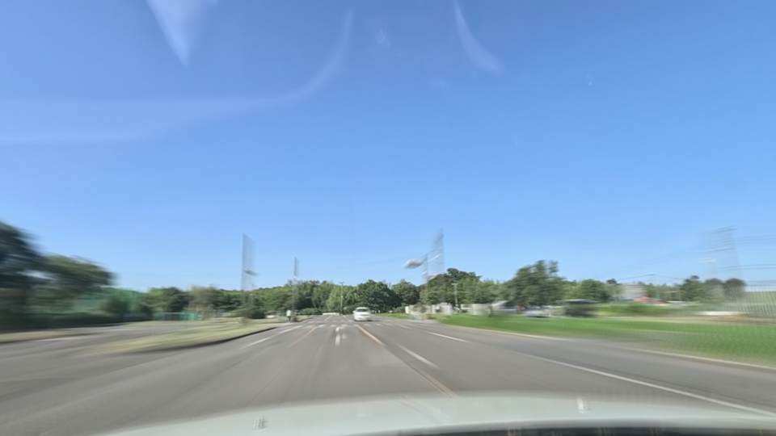
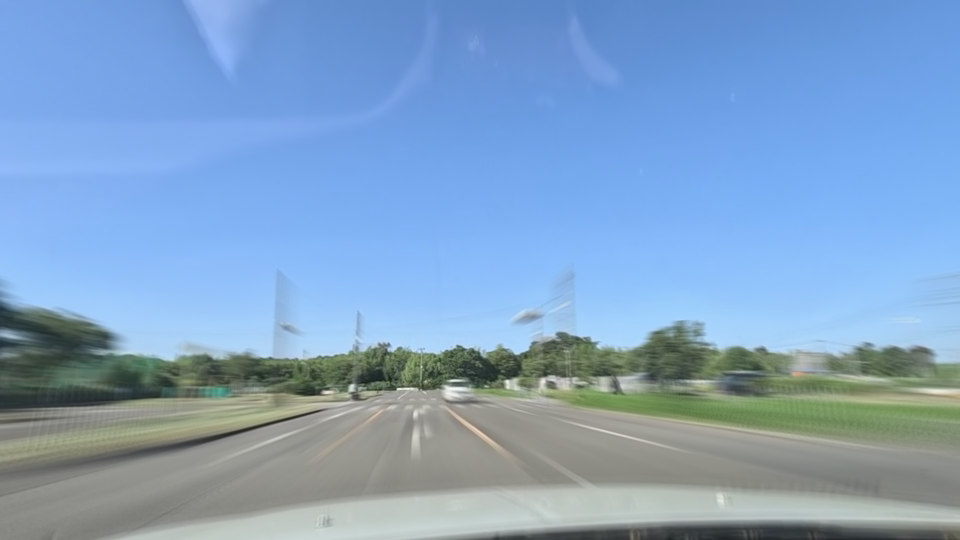
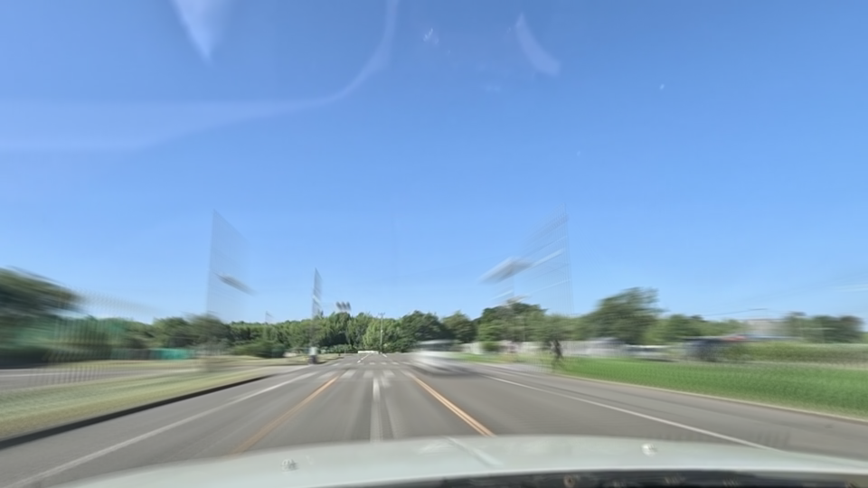
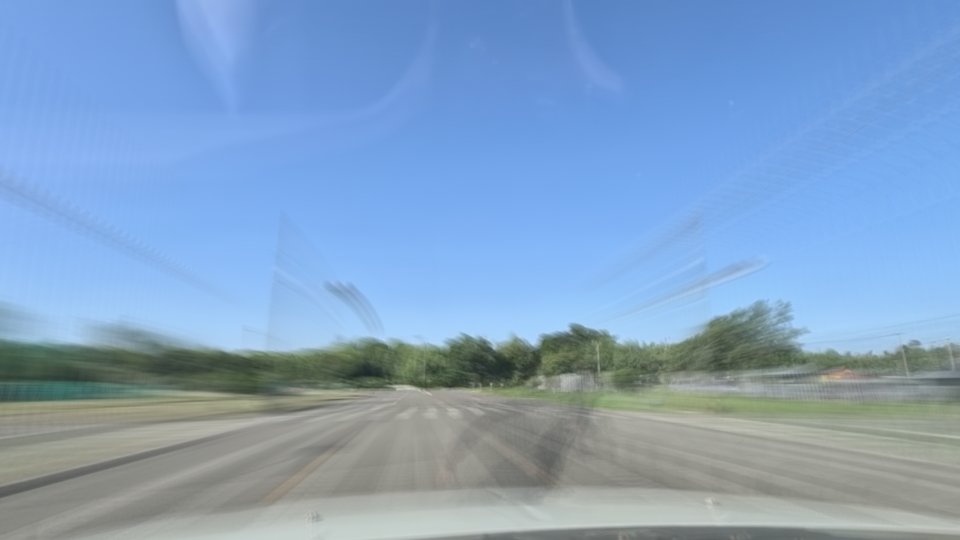
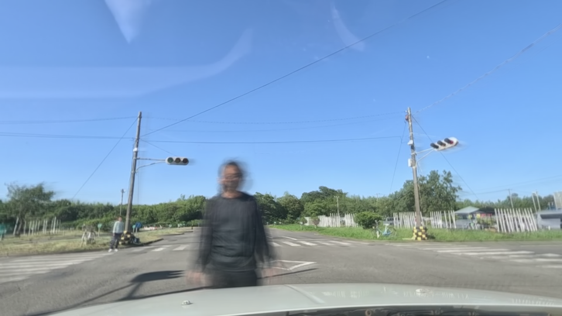

# Traffic Description using Motion Blur 

The Motion Blur image is created by adding up the frames of each phase and multiplying by the weight corresponding to the order of that frame.

$$ motion\_ blur = \sum ^{len(frames)} _{i=1} {i \times frames_i \over len(frames)} $$

- This is the process script to convert the video into motion blur image:

```python
def create_average_image(frames, weights=None):
    if weights is None:
        weights = [x + 1 for x in range(len(frames))]
        
    # normalize weights to sum to 1
    weights = np.array(weights) / np.sum(weights)
    
    # create average image
    average_image = np.zeros(frames[0].shape, dtype=np.float32)
    for frame, weight in zip(frames, weights):
        average_image += frame * weight
    
    # convert to uint8 and return
    average_image = average_image.astype(np.uint8)
    return average_image

def processing(video_path, sec, _):
    vidcap = cv2.VideoCapture(video_path)
    vidcap.set(cv2.CAP_PROP_POS_MSEC,float(sec)*1000)
    hasFrames,image = vidcap.read()
    image = cv2.resize(image, (224, 224))
    frames = [image]
    while hasFrames and vidcap.get(cv2.CAP_PROP_POS_MSEC) < float(_)*1000:
        hasFrames,image = vidcap.read()
        if hasFrames:
            image = cv2.resize(image, (224, 224))
            frames.append(image)
    
    return create_average_image(frames), frames[0]
    
    if hasFrames:
        return image
    else:
        return None
```

- The example of Motion Blur image:

Phase 0 |Phase 1 | Phase 2|
:-------------------------:|:-------------------------:|:-------------------------:
 | | 

Phase 3 |Phase 4|
:-------------------------:|:-------------------------:
 | 
